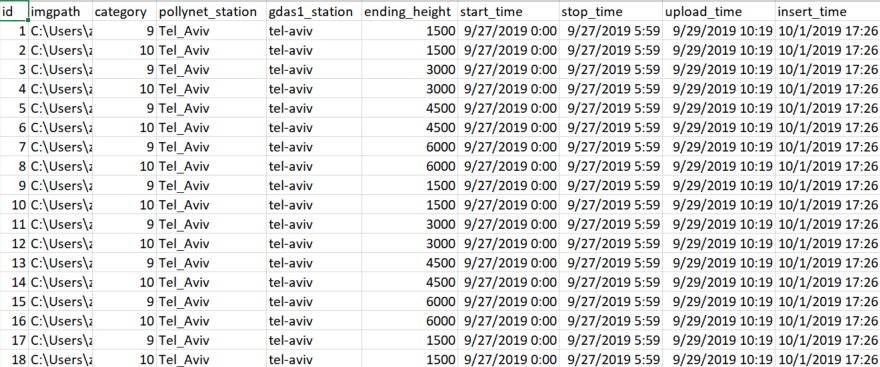
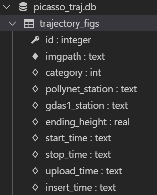

# Trajectory files Scanner for Picasso

The repo helps to scan the trajectory figures to a local [**SQLite3**](https://www.sqlitetutorial.net/) database. Thus make it convenient for Python Developers to extract the data and setup the **done_filelist.txt**. The latter is necessary for adding data into the new Polly Database.

## Download

```text
git clone https://github.com/ZPYin/traj_file_scanner.git
```

or click [here](https://github.com/ZPYin/traj_file_scanner/archive/master.zip) for direct download.

## Usage

### setup a new virtual environment

```text
conda create -n traj_scanner
activate traj_scanner   # windows
source activate traj_scanner   # linux
```

### install the dependencies

```text
cd traj_file_scanner
conda install python=3.6
pip install -r requirements.txt
```

### configurations

You may only need to configure the [`TRAJECTORY_ROOT`](./config/scanner_config.toml) and [`db_path`](./config/db_config.toml), according to your own demands.

### Run the code

```
cd src
python trajectory_scanner.py
```

## Database structure



### Database table



**ID**

- auto-increment from 1
- [INT](https://www.sqlitetutorial.net/sqlite-data-types/)

**imgpath**

- fullpath of the figure
- [TEXT](https://www.sqlitetutorial.net/sqlite-data-types/)

**category**

- product type

|value|            type                 |
|:---:|:--------------------------------|
|1    |geonames-abs-regions-ens-below2.0|
|2    |geonames-abs-regions-ens-below5.0|
|3    |geonames-abs-regions-ens-below8.0|
|4    |geonames-abs-regions-ens-belowmd |
|5    |land-use-occ-ens-below2.0        |
|6    |land-use-occ-ens-below5.0        |
|7    |land-use-occ-ens-below8.0        |
|8    |land-use-occ-ens-belowmd         |
|9    |trajectories_map                 |
|10   |trajectories_prof                |

- [INT](https://www.sqlitetutorial.net/sqlite-data-types/)

**pollynet_station**

- PollyNET station name
- [TEXT](https://www.sqlitetutorial.net/sqlite-data-types/)

**gdas1_station**

- gdas1 station name
- [TEXT](https://www.sqlitetutorial.net/sqlite-data-types/)

Note: this name is unique and it can be projected to multiple PollyNET station name. The lookup table can be found in [name_lookup_table](./config/station_name_lookup_table.toml).

**ending_height**

- ending height of the trajectories.
- [REAL](https://www.sqlitetutorial.net/sqlite-data-types/)

**start_time**

- start time of the figure
- [TEXT](https://www.sqlitetutorial.net/sqlite-data-types/)

**stop_time**

- stop time of the figure
- [TEXT](https://www.sqlitetutorial.net/sqlite-data-types/)

**upload_time**

- upload time of the figure
- [TEXT](https://www.sqlitetutorial.net/sqlite-data-types/)

**insert_time**

- insert time of the entry
- [TEXT](https://www.sqlitetutorial.net/sqlite-data-types/)

## Contact

- Zhenping
- zhenping@tropos.de